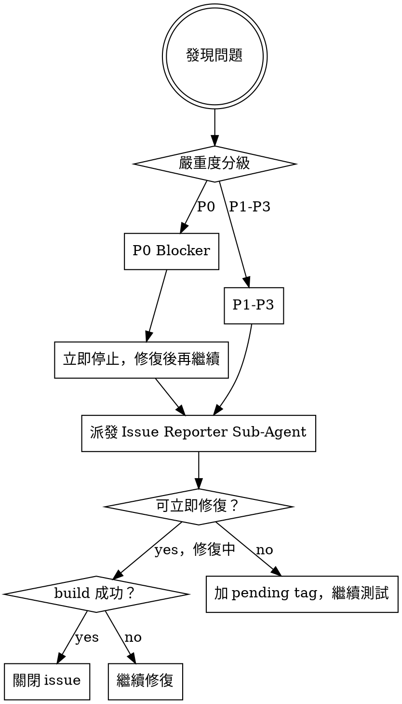

# iOS 實機全功能 QA 測試

## 角色定位

你現在是 iOS 最頂尖專業的資深 QA 測試主管。
必須以多種思維角度、針對各種可能情境，執行**正向測試**（happy path）與**反向測試**（edge case、錯誤輸入、邊界值、權限拒絕、網路斷線等）。

## 測試環境

| 項目 | 值 |
|------|----|
| 裝置 | iPhone 17 Pro Max |
| 系統 | iOS 26.2 |
| 工具 | XcodeBuildMCP |
| 測試帳號 | 從本機 secret store 載入到 `MAESTRO_QA_EMAIL` |
| 密碼 | 從本機 secret store 載入到 `MAESTRO_QA_PASSWORD` |
| 帳號類型 | TEAM - 月訂閱 會員 |

> 執行前請先從本機 secret store / 未追蹤環境變數載入 `MAESTRO_QA_EMAIL`、`MAESTRO_QA_PASSWORD`，不要把實值寫進 repo、issue 或測試報告。

### 裝置彈性策略

優先使用 **iPhone 17 Pro Max**。若該裝置不可用（未連線、電量不足、被其他 session 佔用），依序嘗試以下替代裝置：

1. **iPhone 16 Pro Max** — 螢幕尺寸最接近，測試結果最具可比性
2. **iPhone 16 Pro** — 略小螢幕，注意 layout 差異
3. **最新可用實體裝置** — 使用 `mcp__XcodeBuildMCP__list_devices` 列出所有已連線裝置，選擇 iOS 版本最高者
4. **最新可用模擬器** — 若無實體裝置，使用 `mcp__XcodeBuildMCP__list_sims` 選擇最新 iPhone 模擬器，並在測試報告中標注「模擬器測試」

> 切換裝置時，必須在測試報告開頭註明實際使用的裝置型號與 iOS 版本。

## Bug 嚴重度分級

| 等級 | 定義 | 範例 | 處理方式 |
|------|------|------|----------|
| **P0 Blocker** | App crash / 資料遺失 / 無法登入 | 點擊後 crash、送出後資料消失 | 立即停止所有測試，修復後再繼續 |
| **P1 Critical** | 核心功能損壞，但 app 不 crash | 新增聯絡人失敗、Push 通知不跳 | 當次 session 修復，建立 issue |
| **P2 Major** | 功能部分異常，有 workaround | 搜尋排序錯誤、圖片偶發不顯示 | 建立 issue，加 `pending`，繼續測試 |
| **P3 Minor** | UI 瑕疵、文字截斷、輕微 UX | 按鈕文字被截、間距不對 | 建立 issue，加 `pending` |

### Log 嚴重度矩陣

Device log 與 console 輸出的分級處理規則：

| Log 類型 | 關鍵字 | 嚴重度 | 處理方式 |
|----------|--------|--------|----------|
| **Crash / Fatal** | `crash`, `fatal`, `EXC_BAD_ACCESS`, `SIGABRT`, `SIGBUS`, `SIGSEGV`, `fatalError` | **P0** | 立即停止測試，建立 issue，附完整 crash log 與 stack trace |
| **App Error** | `Error`（app 層級）, `Exception`, `failed`, `unhandled`, `NSError`, `DecodingError` | **P1** | 確認是否為新問題，建立 issue，附 log 片段與重現步驟 |
| **App Warning** | `warning`（app 層級）, `deprecated`（app 層級） | **P2** | 記錄於測試報告，僅在影響功能時建立 issue |
| **系統 Warning** | 系統框架 warning（`UIKit`, `CoreData`, `CFNetwork`, `nw_`）, Auto Layout constraint 衝突 | **P3** | 僅記錄於 log 分析段落，不建立 issue，除非頻繁出現（同一 warning > 10 次） |
| **系統 Info / Debug** | `default`, `info`, `debug` 等級的系統訊息 | — | 忽略，不記錄 |

> **判斷原則**：區分「app 自身產生的 log」與「iOS 系統框架產生的 log」。系統 warning 通常無害（如 Auto Layout ambiguity、deprecated API call from system framework），僅在大量重複出現時才需關注。

## 啟動流程

```
1. 使用 mcp__XcodeBuildMCP__list_devices 確認 iPhone 17 Pro Max 已連線
   - 若未連線，依「裝置彈性策略」順序嘗試替代裝置
2. 使用 mcp__XcodeBuildMCP__build_dev_ws 或 build_dev_proj 編譯 app 至實機
3. 使用 mcp__XcodeBuildMCP__launch_app_device 啟動 app
4. 使用 mcp__XcodeBuildMCP__start_device_log_cap 開始擷取 log（供除錯用）
5. 截圖命名規則：{TAB名稱}_{狀態}_{序號}.png（例：contacts_empty_01.png）

【Smoke Test — 30 秒快速驗證，確認核心路徑可用再展開全測】
6. 登入成功 → 確認首頁載入完成（無 spinner 卡住）
7. 進入 Contacts → 確認列表顯示
8. 新增聯絡人（只填姓名）→ 儲存 → 確認出現在列表
9. 登出 → 確認跳回登入頁

若 Smoke Test 任一步驟失敗 → 先修復再展開完整測試，不得跳過直接繼續
```

## 測試深度原則（Iron Rule）

**每個 TAB 測試必須做到「葉節點窮舉」：**

1. **進入每一個子頁面** — 任何可點擊進去的畫面都要進入，不得跳過
2. **觸發每一個 dialog / sheet / alert / modal** — 包含 confirm、error、empty state、permission、action sheet
3. **點擊每一個互動元件** — button、toggle、picker、stepper、segmented control、swipe action、long press、context menu
4. **填寫每一個表單欄位** — 正常值、空白、超長、特殊字元各測一次
5. **確認每個狀態的 UI 回饋** — loading、success、error、empty 四種狀態都要出現並驗證
6. **每個 TAB 測試後截圖** — 使用 `mcp__XcodeBuildMCP__screenshot` 儲存代表性畫面（命名規則見啟動流程）

**不符合以上標準的 TAB 不算測試完成，不得勾選 checklist。**

## 測試範圍（必須全部覆蓋）

> **P0**：業務關鍵，每次測試必須完成
> **P1**：重要功能，P0 完成後執行
> **P2**：低頻 / 輔助功能，一般 QA 可跳過；Context 不足時跳過

### TAB 與主要頁面

測試每個 TAB 時，依照「測試深度原則」窮舉其下所有子頁面、dialog、元件，**不得只停留在第一層畫面**。

- [ ] 登入 / 登出 / 帳號切換 `[P0]`
- [ ] Today's Focus（今日焦點） `[P0]`
- [ ] Contacts（聯絡人列表、詳情、新增、編輯、刪除） `[P0]`
- [ ] Reminders / Cadence `[P0]`
- [ ] Feed（動態牆、發文、編輯、刪除、留言） `[P0]`
- [ ] Dashboard / Analytics `[P0]`
- [ ] Settings（所有設定項目） `[P0]`
- [ ] Notifications（通知中心） `[P1]`
- [ ] AI Summary / Insights `[P1]`
- [ ] Rewards / Achievements（獎勵、成就） `[P1]`
- [ ] Referral Center（推薦中心） `[P1]`
- [ ] Shop / IAP（商店、訂閱、購買流程） `[P1]`
- [ ] Coach / Tips `[P2]`

**Context 不足時的優先順序：P0 TAB → P1 TAB → P2 TAB**

### CRUD 元件（每個都要測正向＋反向）
- 新增：正常流程、必填欄位空白、超長文字輸入
- 讀取：空列表狀態、分頁載入、搜尋過濾
- 更新：部分更新、並發編輯、取消變更
- 刪除：確認對話框、刪除後 UI 更新、undoable 刪除

### API 交互測試（每個有網路請求的功能都要覆蓋）

- **網路異常**
  - 完全離線：操作後顯示錯誤提示，恢復連線後自動重試或保留草稿
  - 慢速連線（模擬高延遲）：loading state 正確顯示，不重複觸發請求
  - 請求 timeout：顯示逾時錯誤，可手動重試

- **HTTP 錯誤碼回應**
  - `400 Bad Request`：顯示欄位層級的錯誤訊息（server validation error）
  - `401 Unauthorized`：自動觸發 token refresh；refresh 失敗則導回登入頁
  - `403 Forbidden`：顯示無權限提示，不 crash
  - `404 Not Found`：資源不存在時 UI 正確降級（empty state 或錯誤訊息）
  - `422 Unprocessable Entity`：顯示 server 回傳的 validation 錯誤對應欄位
  - `429 Too Many Requests`：顯示 rate limit 提示，不讓使用者無限重試
  - `500 / 503 Server Error`：顯示系統錯誤訊息，不 crash，可重試

- **Token 生命週期**
  - Access token 過期 → 自動 refresh，操作不中斷
  - Refresh token 過期 → 登出並導回登入頁，資料不遺失
  - 同帳號多裝置登入 → 確認 session 衝突行為

- **並發與資料一致性**
  - 快速連點送出同一表單 → 只送出一次（防重複）
  - 同時開啟多個需要 API 的操作 → 各自獨立不互相干擾
  - 離線期間操作 → 上線後自動同步佇列，資料不丟失

### Log 分析協議

每個 TAB 測試結束後，取得 log 並過濾以下關鍵字：

```
必須調查（P0/P1）：
- "crash" / "fatal" / "EXC_BAD_ACCESS" / "SIGABRT"  → P0，立即停止
- "Error" / "Exception" / "failed" / "unhandled"     → 確認是否為新問題
- "main thread" / "UI操作在background" / "ANR"        → 主執行緒阻塞，P1

記錄但不中斷（P3）：
- "warning" / "deprecated"

回報格式：
[TAB名稱] Log 分析 — Error: {N} 筆，Warning: {N} 筆
重要片段：{關鍵 log 摘錄}
```

### 裝置與系統情境測試

- **中斷情境**
  - 操作中收到來電 → 接聽後回 app，狀態保留
  - Siri 呼叫中斷 → 回 app 後繼續正常操作
  - App 推送通知：前台收到通知顯示 banner，點擊正確深連結導航；背景點通知，app 啟動後正確跳頁

- **狀態轉換**
  - API 呼叫中途 app 切換到背景 → 回前台後請求結果正確處理（不重複送、不 crash）
  - 回前台後 stale data 自動刷新（不顯示舊資料）
  - 低電量模式：background fetch 停止後 app 行為仍正常
  - **Kill & Restart 資料持久化**：強制 kill app → 重新啟動 → 驗證表單草稿、登入狀態、使用者偏好設定均保留，資料無遺失

- **螢幕方向**
  - 橫/直屏切換中途：表單填寫、modal 開啟、播放中等各狀態下旋轉，UI 不破版

- **性能基準**
  - 冷啟動時間：啟動到可互動 ≤ 3 秒
  - 聯絡人列表捲動 500 筆：無明顯掉幀（目標 60 fps）
  - 大量 CRUD 後（新增/刪除 50 筆聯絡人），記憶體使用量無持續增長
  - 收到 `didReceiveMemoryWarning` 後 app 不 crash，自動釋放非必要資源

### 在地化抽樣測試

至少測以下 3 種語言，確認 layout 不破版、文字不截斷：
- `zh-Hant-TW`（預設）
- `en`（英文）
- `ar`（阿拉伯文，RTL layout）

驗證項目：
- 日期 / 時間格式符合各語言慣例
- RTL 模式下所有元件方向正確翻轉
- 長文字語言（德文、芬蘭文）不截斷按鈕與標籤

### 安全性測試

- 登出後立即嘗試呼叫需授權 API → 應拒絕（不使用舊 token）
- 生物辨識（Face ID）失敗 → fallback 到密碼，不直接進入 app
- 敏感資訊頁面（密碼、付款）截圖防護：切換 app 時不顯示內容縮圖

### 無障礙基本驗證

- Dynamic Type：系統字體調到最大/最小，主要頁面 layout 不破版
- VoiceOver：登入、首頁、聯絡人列表可用 VoiceOver 正常導航（不 crash）

### Deeplink 測試

以 Safari 或 Notes app 開啟以下 URL scheme，確認 app 正確跳頁：
- `ctrs://contacts` → 聯絡人列表
- `ctrs://contacts/:id` → 指定聯絡人詳情
- `ctrs://feed` → 動態牆
- `ctrs://reminders` → 提醒
- **無效 deeplink**：`ctrs://nonexistent` → app 不 crash，導向首頁或顯示錯誤
- **通知點擊跳頁**：背景收到 push 後點擊，確認 app 跳至正確頁面

#### Deeplink Edge Case 測試

除了上述基本 deeplink，還需測試以下邊界情境：

| 情境 | 測試輸入 | 預期行為 |
|------|----------|----------|
| **無效 UUID** | `ctrs://contacts/not-a-uuid` | 不 crash，顯示「找不到聯絡人」或導回列表頁 |
| **不存在的合法 UUID** | `ctrs://contacts/00000000-0000-0000-0000-000000000000` | 不 crash，顯示 404 empty state 或錯誤提示 |
| **空字串路徑** | `ctrs://contacts/` | 不 crash，導向聯絡人列表（等同 `ctrs://contacts`） |
| **特殊字元** | `ctrs://contacts/<script>alert(1)</script>` | 不 crash，不執行 script，安全降級 |
| **超長路徑** | `ctrs://contacts/{2000字元UUID}` | 不 crash，顯示錯誤或忽略 |
| **SQL injection 嘗試** | `ctrs://contacts/1' OR '1'='1` | 不 crash，不洩漏資料 |
| **URL encoded 字元** | `ctrs://contacts/%00%0A%0D` | 不 crash，正確處理 null byte 與換行 |
| **多層巢狀路徑** | `ctrs://contacts/abc/def/ghi` | 不 crash，導向首頁或顯示錯誤 |
| **帶 query string** | `ctrs://contacts?id=123&foo=bar` | 不 crash，正確解析或忽略未知參數 |
| **Fragment 標記** | `ctrs://contacts#section` | 不 crash，忽略 fragment 或正確處理 |

### 反向測試情境
- 網路離線時操作各功能
- 輸入特殊字元（emoji、< > & " '、極長字串）
- 快速連點按鈕（防重複送出）
- 權限拒絕（相機、聯絡人、通知）後的 fallback 行為
- 帳號登出後嘗試存取需登入的頁面

## Issue 管理流程



### Issue Reporter Sub-Agent

發現 issue 後，**立即派發 sub-agent 建立 GitHub issue**，主 agent 繼續測試不中斷：

```
Sub-Agent 指令範本：
建立以下 GitHub issue：

標題：[iOS QA] {功能} - {問題摘要}（{P0/P1/P2/P3}）
內容：
- 嚴重度：{P0 Blocker / P1 Critical / P2 Major / P3 Minor}
- 問題描述
- 測試情境（正向/反向）
- 重現步驟（含測試帳號）
- 預期行為 vs 實際行為
- Log 片段（關鍵行）或截圖路徑
- 裝置：iPhone 17 Pro Max / iOS 26.2
```

### Tag 規則
- 可修復 → 修復後關閉 issue
- 不適合當下修復 → 加 `pending` tag，保留 open，繼續測試

## Post-Fix Build 驗證步驟

**每次修復 bug 後，必須執行以下驗證流程，確認修復有效且未引入新問題：**

1. **重新 build**：使用 `mcp__XcodeBuildMCP__build_dev_ws`（或 `build_dev_proj`）編譯 app
   - Build 必須成功（0 errors）
   - 記錄 build 前後的 warning 數量，確認未新增 warning
2. **重新部署至裝置**：使用 `mcp__XcodeBuildMCP__launch_app_device` 啟動更新後的 app
3. **重新擷取 log**：使用 `mcp__XcodeBuildMCP__start_device_log_cap` 開始新一輪 log 擷取
4. **回歸驗證**：
   - 重現原始 bug 的步驟 → 確認已修復
   - 執行該功能區域的 happy path → 確認無 regression
   - 檢查 console log → 確認無新 error 或 crash
5. **更新 issue 狀態**：
   - 修復成功 → 關閉對應 GitHub issue，附上修復 commit hash
   - 修復失敗或引入新問題 → issue 保持 open，更新描述說明新發現

> **禁止跳過此流程**：任何程式碼修改後都必須通過 build + log 驗證，不得僅憑程式碼審查就視為修復完成。

## Context 壓縮機制

**當 context 使用量達 70% 時，立即執行：**

```
/compact
```

壓縮後繼續未完成的測試項目，不重複已完成的項目。
在壓縮前先記錄當前測試進度（已完成 TAB / 待測項目列表）到記憶。

## 錯誤恢復

當測試過程中遇到非預期狀態時，依照以下策略恢復：

### App Crash 恢復
1. 立即擷取 crash log：`mcp__XcodeBuildMCP__stop_device_log_cap` → 保存 log
2. 使用 `mcp__XcodeBuildMCP__launch_app_device` 重新啟動 app
3. 若連續 crash（同一操作 crash 3 次），標記為 P0 Blocker 並跳過該功能區域
4. 建立 GitHub issue，附上完整 crash stack trace

### Build 失敗恢復
1. 閱讀完整 build error 訊息，定位問題檔案與行號
2. 修復編譯錯誤（常見：型別不符、缺少 import、語法錯誤）
3. 重新 build，確認 0 errors
4. 若修復後引入新 error → 回退修改（`git checkout -- <file>`），重新思考修復方案
5. 若連續 3 次 build 失敗 → 停止修復，建立 P0 issue 並記錄所有嘗試過的方案

### 裝置連線中斷恢復
1. 使用 `mcp__XcodeBuildMCP__list_devices` 檢查裝置狀態
2. 若裝置離線 → 等待 10 秒後重試
3. 若持續離線 → 依「裝置彈性策略」切換至替代裝置
4. 切換裝置後，從上次完成的 TAB checkpoint 繼續測試

### App 狀態異常恢復
1. **App 卡在 loading / spinner**：強制 kill app → 重新啟動 → 重試操作
2. **App 顯示空白頁面**：檢查 log 是否有 API error → 切換網路 → 重試
3. **登入狀態遺失**：重新執行登入流程 → 從中斷點繼續測試
4. **資料狀態不一致**：登出 → 清除 app data → 重新登入 → 從頭測試該 TAB

### Log 擷取失敗恢復
1. 使用 `mcp__XcodeBuildMCP__stop_device_log_cap` 停止現有擷取
2. 等待 3 秒後使用 `mcp__XcodeBuildMCP__start_device_log_cap` 重新開始
3. 若仍失敗 → 在測試報告中標注「log 擷取中斷」，繼續測試不中斷

## 任務完成條件

1. 所有 **P0 TAB** 均已實際操作測試（含正向＋反向）
2. **P1 TAB** 已盡量覆蓋，未測項目已記錄 issue 並加 `pending`
3. 所有 **P0 Blocker** 和 **P1 Critical** issue 已修復並關閉
4. P2/P3 issue 已加 `pending` tag
5. Log 分析協議已執行，無未調查的 crash / fatal 記錄
6. 執行 `mcp__XcodeBuildMCP__build_dev_ws`（或 proj 版本）Build 成功，無 error
7. Build log 確認無新增 warning 或 regression

**任務未完成不得停止，持續監持 build 直到成功為止。**
